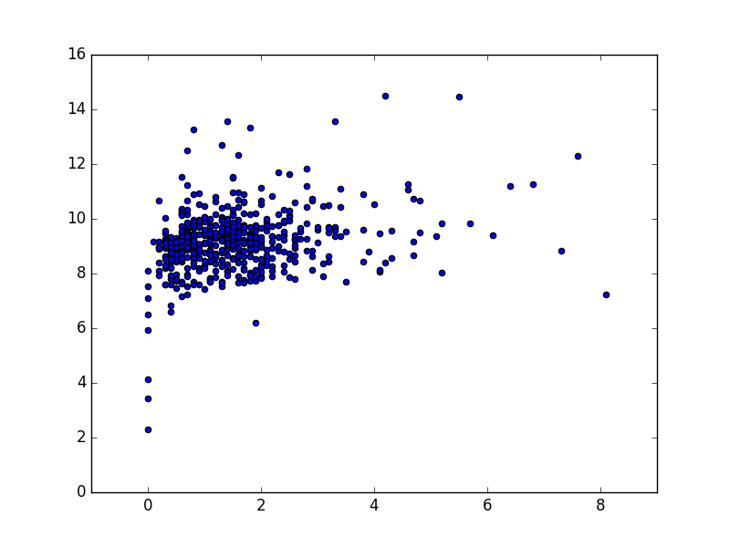

# Extract the useful data points from a profile

Let's read and parse the JSON file at [data/twitter/profiles/10615232.json](data/twitter/profiles/10615232.json) and extract the interesting parts of it into a (simpler) dictionary (that we can later write to a CSV file).

Ignorant of what those fields in the JSON file mean? Please read the Twitter API documentation's overview of the User object: [https://dev.twitter.com/overview/api/users](https://dev.twitter.com/overview/api/users)

OK, let's open the file and deserialize it into a dictionary:

~~~py
import json
from os.path import join
FILENAME = join('data', 'twitter', 'profiles', '10615232.json')

with open(FILENAME, 'r') as rf:
    profile = json.load(rf)
~~~

Poke around the dictionary and see how its structure and content corresponds to the [Twitter API documentation](https://dev.twitter.com/overview/api/users](https://dev.twitter.com/overview/api/users).

~~~py
profile['id']
# 10615232
profile['screen_name']
# 'ChuckGrassley'
profile['profile_image_url']
# 'http://pbs.twimg.com/profile_images/37902202/Official_Portrait__cropped__September_2007_normal.jpg'
~~~

To see how necessary it is to do manually prune and create our own simple data object, check out the number of keys the `profile` dictionary contains:

~~~py
profile.keys()
~~~

~~~stdout
dict_keys(['favourites_count', 'id', 'profile_sidebar_fill_color', 'lang', 
'name', 'profile_text_color', 'created_at', 'profile_image_url', 'time_zone', 
'has_extended_profile', 'contributors_enabled', 'url', 
'profile_sidebar_border_color', 'profile_background_tile', 'statuses_count', 
'screen_name', 'status', 'is_translation_enabled', 'geo_enabled', 
'profile_background_image_url_https', 'profile_background_image_url', 
'profile_background_color', 'friends_count', 'notifications', 
'profile_link_color', 'verified', 'location', 'followers_count', 'id_str', 
'protected', 'default_profile_image', 'default_profile', 
'follow_request_sent', 'utc_offset', 'profile_use_background_image', 
'following', 'profile_image_url_https', 'is_translator', 'description', 
'listed_count', 'entities'])
~~~

So how do we simply the `profile` object? Well, what are the most important things to know about a Twitter user? Let's visit __ChuckGrassley's__ Twitter profile via our browsers to see what Twitter's web designers thought was most important:

[https://twitter.com/ChuckGrassley](https://twitter.com/ChuckGrassley)

Here's a screenshot:

Some key datapoints:

- His (human-readable) name: `ChuckGrassley`
- His screen name: `ChuckGrassley`
- His location: `Iowa`
- His homepage URL: `grassley.senate.gov`
- His join date: `Joined November 2007`
- His tweet count: `4,507`
- How many accounts he follows: `14.4K`
- How many accounts follow him: `96.4K`
- And his profile image: `https://pbs.twimg.com/profile_images/37902202/Official_Portrait__cropped__September_2007_400x400.jpg`
- Whether he is verified (i.e. that blue checkmark)

In Python, create a dictionary that contains just these worthwhile fields. The process goes something like this:

~~~py
d = {}
d['id'] = profile['id'] # good practice to keep track of the unique ID
d['screen_name'] = profile['screen_name']
d['statuses_count'] = profile['statuses_count']
~~~

Note that not all of the field names are obvious, e.g. `statuses_count` corresponds to what we think of as "number of tweets tweeted". Again, that's why you should read the [Twitter API](https://dev.twitter.com/overview/api/users).

Here's one way to quickly serialize an object: list all the headers you want to keep, then use a loop:

~~~py
HEADERS_TO_KEEP = ['id', 'screen_name', 'name', 'created_at',
                    'description', 'location', 'url', 'profile_image_url',
                   'statuses_count', 'friends_count', 'followers_count',
                    'verified']

mydict = {}
for h in HEADERS_TO_KEEP:
    mydict[h] = profile[h]

print(mydict)    
~~~

Much simpler!

~~~stdout
{'created_at': 'Mon Nov 26 15:17:02 +0000 2007', 'friends_count': 14368, 
'verified': True, 'followers_count': 98429, 'location': 'Iowa', 
'profile_image_url': 'http://pbs.twimg.com/profile_images/37902202/
Official_Portrait__cropped__September_2007_normal.jpg', 'screen_name': 
'ChuckGrassley', 'name': 'ChuckGrassley', 'statuses_count': 4507, 'id': 
10615232, 'description': 'U.S. Senator. Family farmer. Lifetime resident of 
New Hartford, IA. Also follow @GrassleyPress for news and information.', 
'url': 'https://t.co/CM45Tl33ts'}
~~~

## Combining simple profiles into one CSV

This is pretty straightforward once you've figured out how to deal with each individual JSON file. Just use glob and a for-loop:

~~~py
from glob import glob
from os import makedirs
from os.path import join
import csv
import json
HEADERS_TO_KEEP = ['id', 'screen_name', 'name', 'created_at',
                    'description', 'location', 'url', 'profile_image_url',
                   'statuses_count', 'friends_count', 'followers_count',
                    'verified']

JSON_DIR = join('data', 'twitter', 'profiles')
OUTPUT_DIR = join('data', 'wrangled')
OUTPUT_FILENAME = join(OUTPUT_DIR, 'simple-twitter-profiles.csv')
makedirs(OUTPUT_DIR, exist_ok=True)

# set up the CSV file
wf = open(OUTPUT_FILENAME, 'w')
wcsv = csv.DictWriter(wf, fieldnames=HEADERS_TO_KEEP)
wcsv.writeheader()

json_filenames = glob(join(JSON_DIR, '*.json'))
for jname in json_filenames:
    with open(jname, 'r') as rf:
        profile = json.load(rf)
        mydict = {}
        for h in HEADERS_TO_KEEP:
            mydict[h] = profile[h]
        # write to CSV
        wcsv.writerow(mydict)

wf.close()
~~~

### Why CSV?

The main goal is to take all of those profiles in [data/twitter/profiles](data/twitter/profiles) and turn it into a nice, flat CSV: [data/wrangled/simple-twitter-profiles.csv](data/wrangled/simple-twitter-profiles.csv)

Converting to CSV has its tradeoffs. Obviously, turning a bunch of JSONs into data is as easy as doing so for a single CSV file if you know how to program. And CSV being inherently simpler requires us to simplify the original JSON data.

On the other hand, simple CSV is more ready-to-use than JSON. For example, that's why Github [renders a pretty table view when showing a CSV file:](data/wrangled/simple-twitter-profiles.csv)

...while [visiting a Github-hosted JSON file](data/twitter/profiles/10615232.json) just shows you the contents pretty much as-is -- there's no simple interface that could encompass the variety of data structures in any given JSON file.

Another example of a program that can easily connect with CSV: __pandas__: here's a quick analysis and scatterplot using pandas and matplotlib, including finding out the top 5 most followed Twitter accounts, deriving the average number of tweets per day, and graphing a scatterplot of `tweets_per_day` vs. `followers_count`:

~~~py
from os.path import join
from datetime import datetime
import pandas as pd
import matplotlib.pyplot as plt

WRANGLED_DIR = join('data', 'wrangled')
CSV_FILENAME = join(WRANGLED_DIR, 'simple-twitter-profiles.csv')
df = pd.read_csv(CSV_FILENAME, parse_dates=['created_at'])
# add a number of tweets per day column
daysage = (datetime.now() - df['created_at']).dt.days # this is an array
df['tweets_per_day'] = (df['statuses_count'] / daysage).round(1)

# top 5 users by followers
top5 = df.sort_values('followers_count', ascending=False).head(5)
top5[['screen_name', 'followers_count', 'tweets_per_day']]
#        screen_name  followers_count
# 165  SenJohnMcCain          2002951
# 357     SenSanders          1923749
# 116    NancyPelosi           787787
# 38      SenTedCruz           778069
# 157    SpeakerRyan           626366

fig, ax = plt.subplots()
ax.scatter(df['tweets_per_day'], df['followers_count'])
~~~

Let's try charting against `log(df['followers_count'])` (using __numpy__), since some users have exponentially more followers than others:

~~~py
import numpy as np
fig, ax = plt.subplots()
ax.scatter(df['tweets_per_day'], np.log(df['followers_count']))
~~~

